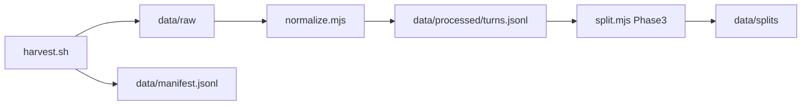

# Pipeline



## 1. Harvest

Collect Cursor `agent-transcripts` from host and/or devcontainer into archives and optionally unpack.

```bash
# Full extract: all ~/.cursor workspaces + subagents, Work/personal devcontainer projects
pnpm harvest:all

# Host only — every workspace under ~/.cursor/projects
pnpm harvest:host -- --all --unpack

# Work/personal devcontainer workspaces (slug contains Work-personal or workspaces-*)
pnpm harvest:devcontainer -- --unpack

# Filter by repo name fragment
CURSOR_REPO_NAMES=devprofile,premflow pnpm harvest:host -- --unpack
```

Environment:

| Variable | Default | Purpose |
|----------|---------|---------|
| `CURSOR_PROJECTS_HOST` | `$HOME/.cursor/projects` | Host Cursor projects root |
| `CURSOR_PROJECTS_DEVCONTAINER` | `$HOME/.cursor/projects` | In-container projects root |
| `CURSOR_REPO_NAMES` | (all matching) | Comma-separated repo folder names to filter host harvest |
| `CURSOR_TRANSCRIPTS_DEVCONTAINER` | auto-detect | Override devcontainer `agent-transcripts` path |

Archives: `data/backups/agent-transcripts-{host,devcontainer}.zip`

Unpack layout:

```text
data/raw/host/<YYYYMMDD>/<workspace-slug>/<session-id>/<session-id>.jsonl
data/raw/host/<YYYYMMDD>/<workspace-slug>/<session-id>/subagents/<subagent-id>.jsonl
data/raw/devcontainer/<YYYYMMDD>/<workspace-slug>/…
data/raw/manual/<session-id>.jsonl
```

## 2. Normalize (Phase 2)

```bash
pnpm normalize                    # default: --source host
node scripts/normalize.mjs --source all   # dedup by session_id across sources
```

Reads `data/raw/**/*.jsonl`, writes `data/processed/turns.jsonl` (see [SCHEMA.md](./SCHEMA.md)).

| `--source` | Behavior |
|------------|----------|
| `host` (default) | Only `data/raw/host/**` — avoids host/devcontainer double-count |
| `devcontainer` | Only `data/raw/devcontainer/**` |
| `manual` | Only `data/raw/manual/**` |
| `all` | All sources; one file per `session_id` (prefer host, workspace path, newest mtime) |

Rules: strip skill bodies, group by user turn, path → `{REPO_ROOT}`, skip `[REDACTED]`-only assistant rows, set `parent_session_id` for subagent files.

### Manifest tags

```bash
pnpm tag-manifest -- --tag gold --session-id <uuid>
pnpm tag-manifest -- --tag gold --repo devprofile --limit 5
```

See [GOLD_SESSIONS.md](./GOLD_SESSIONS.md) for committable gold session ids.

## 3. Split (Phase 3 — planned)

`scripts/split.mjs`: train / eval / discard by session_id and heuristics; export OpenAI-messages and prompt-completion JSONL.

## Host vs devcontainer

| Where | What works |
|-------|------------|
| **Host** (`~/Work/personal/agent-prompt-tuning-lab`) | Full `~/.cursor` harvest with `--all`; includes subagents and all Work/personal project slugs |
| **Devcontainer** | Run `harvest:devcontainer` inside a container, or on host to copy Work/personal workspaces only |

Weekly habit on host: `pnpm harvest:all`
