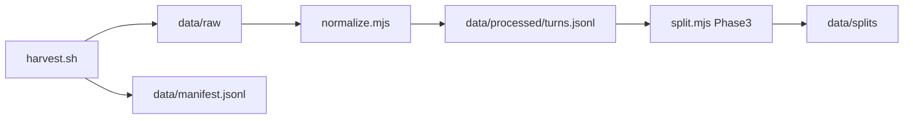

# Pipeline



## 1. Harvest

Collect Cursor `agent-transcripts` from host and/or devcontainer into archives and optionally unpack.

```bash
# Host (run on machine with ~/.cursor)
pnpm harvest:host
pnpm harvest:host -- --unpack

# Devcontainer
pnpm harvest:devcontainer -- --unpack

# Both + unpack into data/raw/<source>/<date>/
pnpm harvest:unpack
```

Environment:

| Variable | Default | Purpose |
|----------|---------|---------|
| `CURSOR_PROJECTS_HOST` | `$HOME/.cursor/projects` | Host Cursor projects root |
| `CURSOR_PROJECTS_DEVCONTAINER` | `$HOME/.cursor/projects` | In-container projects root |
| `CURSOR_REPO_NAMES` | (all matching) | Comma-separated repo folder names to filter host harvest |
| `CURSOR_TRANSCRIPTS_DEVCONTAINER` | auto-detect | Override devcontainer `agent-transcripts` path |

Archives: `data/backups/agent-transcripts-{host,devcontainer}.zip`

Unpack layout: `data/raw/{host,devcontainer,manual}/<session-id>/…jsonl` or flat `manual/<session-id>.jsonl`

## 2. Normalize (Phase 2)

```bash
pnpm normalize
```

Reads `data/raw/**/*.jsonl`, writes `data/processed/turns.jsonl` (see [SCHEMA.md](./SCHEMA.md)).

Rules: strip skill bodies, group by user turn, path → `{REPO_ROOT}`, skip `[REDACTED]`-only assistant rows.

## 3. Split (Phase 3 — planned)

`scripts/split.mjs`: train / eval / discard by session_id and heuristics; export OpenAI-messages and prompt-completion JSONL.

## Host vs devcontainer

| Where | What works |
|-------|------------|
| **Host** | Full `~/.cursor` harvest; move this repo here after extracting from devprofile |
| **Devcontainer** | Only in-container transcripts (`workspaces-<repo>` slug) |

Weekly habit: `pnpm harvest:both -- --unpack` on host.
