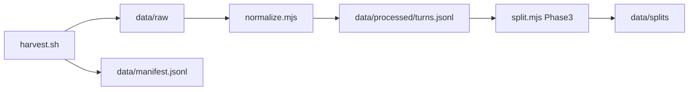

# Pipeline



## 1. Harvest

Collect Cursor `agent-transcripts` from host and/or devcontainer into archives and optionally unpack.

```bash
# Full extract: all ~/.cursor workspaces + subagents, Work/personal devcontainer projects
pnpm harvest:all

# Host only — every workspace under ~/.cursor/projects
pnpm harvest:host -- --all --unpack

# Work/personal devcontainer workspaces (slug contains Work-personal or workspaces-*)
pnpm harvest:devcontainer -- --unpack

# Filter by repo name fragment
CURSOR_REPO_NAMES=devprofile,premflow pnpm harvest:host -- --unpack
```

Environment:

| Variable | Default | Purpose |
|----------|---------|---------|
| `CURSOR_PROJECTS_HOST` | `$HOME/.cursor/projects` | Host Cursor projects root |
| `CURSOR_PROJECTS_DEVCONTAINER` | `$HOME/.cursor/projects` | In-container projects root |
| `CURSOR_REPO_NAMES` | (all matching) | Comma-separated repo folder names to filter host harvest |
| `CURSOR_TRANSCRIPTS_DEVCONTAINER` | auto-detect | Override devcontainer `agent-transcripts` path |

Archives: `data/backups/agent-transcripts-{host,devcontainer}.zip`

Unpack layout:

```text
data/raw/host/<YYYYMMDD>/<workspace-slug>/<session-id>/<session-id>.jsonl
data/raw/host/<YYYYMMDD>/<workspace-slug>/<session-id>/subagents/<subagent-id>.jsonl
data/raw/devcontainer/<YYYYMMDD>/<workspace-slug>/…
data/raw/manual/<session-id>.jsonl
```

## 2. Normalize (Phase 2)

```bash
pnpm normalize                    # default: --source host
node scripts/normalize.mjs --source all   # dedup by session_id across sources
```

Reads `data/raw/**/*.jsonl`, writes `data/processed/turns.jsonl` (see [SCHEMA.md](./SCHEMA.md)).

| `--source` | Behavior |
|------------|----------|
| `host` (default) | Only `data/raw/host/**` — avoids host/devcontainer double-count |
| `devcontainer` | Only `data/raw/devcontainer/**` |
| `manual` | Only `data/raw/manual/**` |
| `all` | All sources; one file per `session_id` (prefer host, workspace path, newest mtime) |

Rules: strip skill bodies, group by user turn, path → `{REPO_ROOT}`, skip `[REDACTED]`-only assistant rows, set `parent_session_id` for subagent files.

### Manifest tags

```bash
pnpm tag-manifest -- --tag gold --session-id <uuid>
pnpm tag-manifest -- --tag gold --repo devprofile --limit 5
```

See [GOLD_SESSIONS.md](./GOLD_SESSIONS.md) for committable gold session ids.

## 3. Split (Phase 3)

Session-level split for prompt tuning, eval, and pattern mining — **not** OpenAI fine-tuning export.

```bash
pnpm split
node scripts/split.mjs --eval-tag gold --seed 42 --eval-ratio 0.2
```

Reads `data/processed/turns.jsonl` (required). Optionally enriches from `data/manifest.jsonl` (`tags`, `repo_hint`, `parent_session_id`).

| Flag | Default | Purpose |
|------|---------|---------|
| `--eval-tag` | `gold` | Manifest tag that always routes sessions to `eval/` |
| `--seed` | `42` | Deterministic shuffle for pool vs eval assignment |
| `--eval-ratio` | `0.2` | Fraction of non-tagged, non-discarded sessions assigned to eval |

### Logic (session-level, no turn leakage)

1. Group turns by `session_id`.
2. Build session metadata: turn count, tool calls, skills, repo hint, tags, subagent link.
3. **Tagged eval** — sessions with manifest tag `gold` (or `--eval-tag`) → always `eval/`.
4. **Family grouping** — parent and subagent children stay in the same bucket (eval or pool).
5. **Discard** low-signal sessions:
   - no turns with assistant text
   - single turn, zero tool calls, user text under 50 chars
   - all assistant text is `[REDACTED]` only (no substantive text after stripping)
6. **Pool split** — remaining sessions: seeded shuffle, `--eval-ratio` to `eval/`, rest to `pool/`.

### Outputs

```text
data/splits/
  eval/turns.jsonl       # held-out exemplars + random eval sessions
  pool/turns.jsonl       # pattern-mining / non-held-out
  discard/turns.jsonl    # low-signal sessions
  sessions.jsonl         # one row per session (split, metadata)
  summary.json           # counts by split, repo, kind — no transcript text
```

Turn rows add `split` and `repo_hint`. See [SCHEMA.md](./SCHEMA.md).

**Note:** Cursor exports do not record Composer vs auto model selection. Splits are by session, tags, and repo — not by model.

## Host vs devcontainer

| Where | What works |
|-------|------------|
| **Host** (`~/Work/personal/agent-prompt-tuning-lab`) | Full `~/.cursor` harvest with `--all`; includes subagents and all Work/personal project slugs |
| **Devcontainer** | Run `harvest:devcontainer` inside a container, or on host to copy Work/personal workspaces only |

Weekly habit on host: `pnpm harvest:all`
