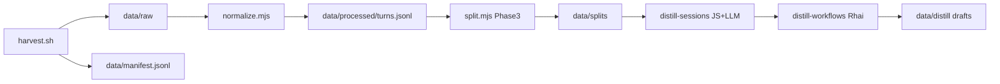

# Pipeline



**Language split:** harvest → normalize → split stay **JavaScript**. The workflow-first distill path is **per-session LLM (JS)** then **Rhai** scoring/aggregation — see [DISTILL.md](./DISTILL.md).

## 1. Harvest

Collect agent transcripts into `data/raw/` (and optional zip backups).

```bash
# Full extract: Cursor host+devcontainer + Grok + Kilo + Cline
pnpm harvest:all

# Cursor only
pnpm harvest:cursor
pnpm harvest:host -- --all --unpack
pnpm harvest:devcontainer -- --unpack
CURSOR_REPO_NAMES=my-app,other-repo pnpm harvest:host -- --unpack

# Other agents (converted to Cursor-shaped JSONL)
pnpm harvest:agents
pnpm harvest:grok
pnpm harvest:kilo
pnpm harvest:cline
```

Environment:

| Variable | Default | Purpose |
|----------|---------|---------|
| `CURSOR_PROJECTS_HOST` | `$HOME/.cursor/projects` | Host Cursor projects root |
| `CURSOR_PROJECTS_DEVCONTAINER` | `$HOME/.cursor/projects` | In-container projects root |
| `CURSOR_REPO_NAMES` | (all matching) | Comma-separated repo folder names to filter host harvest |
| `CURSOR_TRANSCRIPTS_DEVCONTAINER` | auto-detect | Override devcontainer `agent-transcripts` path |
| `GROK_SESSIONS_ROOT` | `$HOME/.grok/sessions` | Grok Build session tree |
| `KILO_TASKS_ROOT` | auto-detect VS Code/Cursor globalStorage | Kilo `tasks/` directory |
| `CLINE_TASKS_ROOT` | auto-detect | Cline (and Roo) `tasks/` directory |

Archives: `data/backups/agent-transcripts-{host,devcontainer}.zip` (optional `--zip` for agent harvests).

Unpack layout:

```text
data/raw/host/<YYYYMMDD>/<workspace-slug>/<session-id>/<session-id>.jsonl
data/raw/host/<YYYYMMDD>/<workspace-slug>/<session-id>/subagents/<subagent-id>.jsonl
data/raw/devcontainer/<YYYYMMDD>/<workspace-slug>/…
data/raw/grok|kilo|cline/<YYYYMMDD>/…/<session-id>.jsonl
data/raw/manual/<session-id>.jsonl
```

Path discovery details: [AGENT_SOURCES.md](./AGENT_SOURCES.md).

## 2. Normalize (Phase 2)

```bash
pnpm normalize                    # default: --source all (multi-agent)
pnpm normalize:host               # Cursor host only
node scripts/normalize.mjs --source grok
```

Reads `data/raw/**/*.jsonl`, writes `data/processed/turns.jsonl` (see [SCHEMA.md](./SCHEMA.md)).

| `--source` | Behavior |
|------------|----------|
| `all` (default via `pnpm normalize`) | All sources; one file per `session_id` (prefer host, then grok, workspace path, newest mtime) |
| `host` | Only `data/raw/host/**` — avoids host/devcontainer double-count |
| `devcontainer` | Only `data/raw/devcontainer/**` |
| `grok` / `kilo` / `cline` | Only that agent’s harvest tree |
| `manual` | Only `data/raw/manual/**` |

Rules: strip skill bodies, group by user turn, path → `{REPO_ROOT}`, skip `[REDACTED]`-only assistant rows, set `parent_session_id` for subagent files.

### Manifest tags

```bash
pnpm tag-manifest -- --tag gold --session-id <uuid>
pnpm tag-manifest -- --tag gold --repo <repo-hint> --limit 5
```

See [GOLD_SESSIONS.md](./GOLD_SESSIONS.md) for committable gold session ids.

## 3. Split (Phase 3)

Session-level split for prompt tuning, eval, and pattern mining — **not** OpenAI fine-tuning export.

```bash
pnpm split
node scripts/split.mjs --eval-tag gold --seed 42 --eval-ratio 0.2
```

Reads `data/processed/turns.jsonl` (required). Optionally enriches from `data/manifest.jsonl` (`tags`, `repo_hint`, `parent_session_id`).

| Flag | Default | Purpose |
|------|---------|---------|
| `--eval-tag` | `gold` | Manifest tag that always routes sessions to `eval/` |
| `--seed` | `42` | Deterministic shuffle for pool vs eval assignment |
| `--eval-ratio` | `0.2` | Fraction of non-tagged, non-discarded sessions assigned to eval |

### Logic (session-level, no turn leakage)

1. Group turns by `session_id`.
2. Build session metadata: turn count, tool calls, skills, repo hint, tags, subagent link.
3. **Tagged eval** — sessions with manifest tag `gold` (or `--eval-tag`) → always `eval/`.
4. **Family grouping** — parent and subagent children stay in the same bucket (eval or pool).
5. **Discard** low-signal sessions:
   - no turns with assistant text
   - single turn, zero tool calls, user text under 50 chars
   - all assistant text is `[REDACTED]` only (no substantive text after stripping)
6. **Pool split** — remaining sessions: seeded shuffle, `--eval-ratio` to `eval/`, rest to `pool/`.

### Outputs

```text
data/splits/
  eval/turns.jsonl       # held-out exemplars + random eval sessions
  pool/turns.jsonl       # pattern-mining / non-held-out
  discard/turns.jsonl    # low-signal sessions
  sessions.jsonl         # one row per session (split, metadata)
  summary.json           # counts by split, repo, kind — no transcript text
```

Turn rows add `split` and `repo_hint`. See [SCHEMA.md](./SCHEMA.md).

**Note:** Cursor exports do not record Composer vs auto model selection. Splits are by session, tags, and repo — not by model.

## Bundles and repo hints

A **bundle** is usually the `repo_hint` parsed from your Cursor workspace slug (see `pnpm insights`). It names:

- turns filtered in `pnpm suggest-artifacts -- --bundle <repo>`
- a folder under `docs/artifacts/<repo>/` when you commit templates

Discover names after split:

```bash
pnpm insights                          # by_repo counts
pnpm suggest-artifacts -- --list       # repo_hints + artifact folders
pnpm install-artifacts -- --list       # committed artifact folders only
```

Use `personal` for cross-repo rules (not tied to one project).

## 4. Distill workflows (Phase 4 — preferred for composable artifacts)

Per-session LLM insight (assistant narrative, sanitized) → Rhai aggregate → workflow/skill/rule drafts.

```bash
pnpm rhai-host:build
pnpm distill-sessions -- --pilot --llm grok          # gold + high-signal parents
pnpm distill-workflows -- --run-dir data/distill/<run-id>
```

Outputs under `data/distill/<run>/` (gitignored). Prefer **workflows** that chain skills over duplicate micro-skills. Full detail: [DISTILL.md](./DISTILL.md).

## 5. Suggest artifacts (legacy / secondary)

LLM-assisted drafting from split stats and sanitized exemplars — **no full transcripts in prompts or git**. Secondary to the distill path above; useful for quick repo-scoped drafts when you do not need workflow composition.

### Recommended providers

| Provider | When | Command / env |
|----------|------|----------------|
| **Grok** (best API) | Fast, cheap, JSON mode | `XAI_API_KEY` + `--llm grok` (model via `XAI_MODEL`; default subject to change) |
| **Cursor IDE** | Paste prompt, no API script | `--llm prompt` → open `PROMPT.md` in Agent/Composer chat |
| **Cursor SDK** | Automate from CI/script | `CURSOR_API_KEY` + `npm install @cursor/sdk` + `--llm cursor` |
| Local Ollama | Opt-in only (slow here) | `--llm ollama` |

`--llm auto` tries **Grok → Cursor SDK → prompt-only**. Local Ollama is excluded from auto.

```bash
pnpm suggest-artifacts -- --list
pnpm suggest-artifacts -- --bundle <repo>              # auto: Grok → Cursor → prompt
pnpm suggest-artifacts -- --bundle <repo> --llm grok   # xAI Grok (XAI_MODEL overrides default)
pnpm suggest-artifacts -- --bundle <repo> --llm cursor # Cursor SDK (cloud default)
pnpm suggest-artifacts -- --bundle <repo> --split pool
pnpm suggest-artifacts -- --bundle <repo> --apply      # copy new drafts → docs/artifacts/
```

Cursor SDK (cloud — default):

```bash
export CURSOR_API_KEY=...
export CURSOR_CLOUD_REPO=https://github.com/you/your-repo.git
pnpm suggest-artifacts -- --bundle <repo> --llm cursor
```

Manual IDE path (no API key): see [PROMPT_MODE.md](./PROMPT_MODE.md).

```bash
pnpm suggest-artifacts -- --bundle <repo> --llm prompt
# Paste PROMPT.md into Cursor Agent chat; save JSON as response.json
pnpm suggest-artifacts -- --bundle <repo> --ingest data/artifact-drafts/<repo>/<ts>/response.json --apply
```

Outputs (gitignored): `data/artifact-drafts/<bundle>/<timestamp>/`

| File | Purpose |
|------|---------|
| `context.json` | Stats, gold ids, exemplar summaries, existing artifact index |
| `PROMPT.md` | Copy-paste prompt for external LLM |
| `response.json` | Raw LLM JSON |
| `rules/*.mdc`, `skills/*/SKILL.md` | Formatted drafts for review |

Env: `XAI_API_KEY`, `XAI_MODEL` (optional; when unset, uses the current code default — today `grok-4.5`, subject to change); `CURSOR_API_KEY`, `CURSOR_MODEL`, `CURSOR_RUNTIME`, `CURSOR_CLOUD_REPO`. Local Ollama: opt-in via `--llm ollama` only.

Review before commit — `--apply` never overwrites existing files in `docs/artifacts/`.

## Host vs devcontainer

| Where | What works |
|-------|------------|
| **Host** | Full `~/.cursor` harvest with `--all`; includes subagents |
| **Devcontainer** | Run `harvest:devcontainer` inside a container, or on host with slug/repo filter |

Weekly habit on host: `pnpm harvest:all && pnpm normalize && pnpm split`, then `pnpm distill:pilot` (or `pnpm pipeline`, which ends at distill). Use `pnpm insights` / `suggest-artifacts` only when you want histogram-based bundle drafts.
