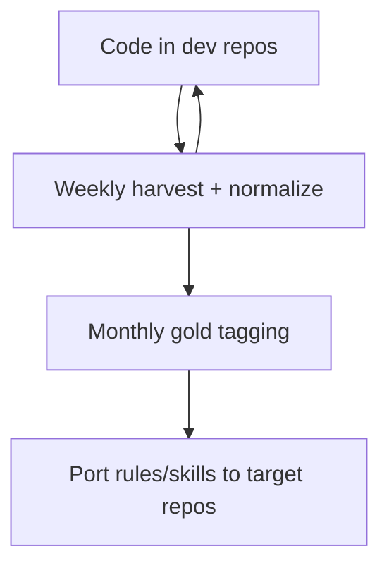

# Operating workflow

This repo is a **personal prompt lab**, not a dataset you clone and run. You keep coding in your dev projects; this toolkit **harvests what actually happened** in Cursor and turns it into reusable prompt, skill, and rule improvements.

## Why

Cursor already logs how you work — tools, skills, subagents, failures. Without a pipeline, that history sits in `~/.cursor` and you cannot:

- See patterns (dominant tools, when skills help, what gets dropped)
- Pick **gold sessions** as few-shot or eval examples
- Export clean eval and pattern-mining splits (`pnpm split`)
- **Port lessons** into `.cursor/rules` and skills in other repos

The value is **closing the loop**: real sessions → structured turns → tagged exemplars → better prompts elsewhere.

See [INSIGHTS.md](./INSIGHTS.md) for aggregate corpus statistics (counts only, no transcript text).

## Weekly habit

```text
┌─────────────────────────────────────────────────────────────┐
│  Mon–Fri: code normally in your dev repos                    │
└───────────────────────────────┬─────────────────────────────┘
                                ▼
┌─────────────────────────────────────────────────────────────┐
│  Weekly (~5 min):  cd agent-prompt-tuning-lab                │
│                    pnpm harvest:all                          │
│                    pnpm seed-manifest                        │
│                    pnpm normalize                            │
│                    pnpm split                                │
└───────────────────────────────┬─────────────────────────────┘
                                ▼
┌─────────────────────────────────────────────────────────────┐
│  Monthly (~30 min): skim INSIGHTS, tag 1–3 gold sessions     │
│                     update GOLD_SESSIONS.md if worth sharing │
└───────────────────────────────┬─────────────────────────────┘
                                ▼
┌─────────────────────────────────────────────────────────────┐
│  When a pattern repeats: copy rule/skill into target repo    │
└─────────────────────────────────────────────────────────────┘
```



Run harvest on the **host** where `~/.cursor/projects` exists. See [PIPELINE.md](./PIPELINE.md) for env vars and selective harvest.

## Commands

| Step | Command | Notes |
|------|---------|--------|
| Pull new chats | `pnpm harvest:all` | Host + Work/personal devcontainer; includes subagents |
| Index | `pnpm seed-manifest` | Usually runs after harvest |
| Flatten | `pnpm normalize` | Default `--source host`; avoids duplicate sessions (see [INSIGHTS.md](./INSIGHTS.md)) |
| Split | `pnpm split` | Session-level eval / pool / discard; gold tags → eval |
| Tag winners | `pnpm tag-manifest -- --tag gold --session-id <uuid>` | Or `--repo <name> --limit 3`; re-run `pnpm split` after tagging |

Full pipeline details: [PIPELINE.md](./PIPELINE.md). Harvest skill: `.cursor/skills/cursor-transcript-harvest/`.

## Frequency

| Cadence | Action |
|---------|--------|
| **Weekly** | `harvest:all` → `seed-manifest` → `normalize` → `split` |
| **After a great session** | Tag it gold immediately |
| **After a bad session** | Note session id; optional `tags: ["anti-pattern"]` later |
| **Monthly** | Refresh [INSIGHTS.md](./INSIGHTS.md) if corpus shape changed materially |
| **Before eval work** | Curate gold set; re-run `pnpm split` after tagging |

## Value outputs

| Output | What it tells you |
|--------|-------------------|
| `data/manifest.jsonl` | Local catalog: repo hints, bytes, lines, tags, `parent_session_id` for subagents |
| `data/processed/turns.jsonl` | One row per user turn: query, reply, tools, skills |
| [INSIGHTS.md](./INSIGHTS.md) | Corpus stats without leaking chat text |
| [GOLD_SESSIONS.md](./GOLD_SESSIONS.md) | Committable list of exemplar session ids |
| `data/splits/` | Eval, pool, and discard turn files plus `sessions.jsonl` / `summary.json` |
| `.cursor/skills` + `.cursor/rules` | Harvest workflow + privacy guardrails in-repo |

**What the corpus suggests** (details in [INSIGHTS.md](./INSIGHTS.md)):

- Tool use dominates → agents are **implementers**; rules should emphasize read → edit → verify.
- Skills attach rarely but correlate with deeper tool use when present → improve **routing** (when to attach a skill), not more skill bodies.
- Most assistant text is `[REDACTED]` → fine for metadata; low-signal sessions land in `data/splits/discard/`.
- Subagent files exist → delegation patterns are learnable via `parent_session_id`.

## Applying lessons (three layers)

Do **not** copy transcripts into other repos. Distill procedure and constraints instead.

### Layer 1: Rules (always-on)

Short constraints that showed up in good turns. Copy verbatim into the target repo:

```text
target-repo/.cursor/rules/
  verify-before-done.mdc     # run install/test/lint before claiming fixed
  minimal-diff.mdc           # Read → StrReplace → ReadLints loop
  explore-return-format.mdc  # subagent-style tasks: tree + flow + pain points
```

**Source:** gold sessions in [GOLD_SESSIONS.md](./GOLD_SESSIONS.md) + local `turns.jsonl` filtered by `tags`.

### Layer 2: Skills (workflow, attach on demand)

Multi-step playbooks, not style guides. Add to a project when local turns show high `tool_call_count`, successful outcomes, and matching user intent — that intent becomes the skill trigger description.

| Skill type | When to add |
|------------|-------------|
| Domain workflow (e.g. UI fusion, large refactors) | Repeated multi-tool success on that task class |
| Harvest / lab skills | Only in this repo |

### Layer 3: Few-shot / eval

Gold and eval-split sessions (`data/splits/eval/`) become:

- **Eval set** — e.g. "given this user query, did the agent verify before claiming done?"
- **Few-shot** — 2–3 anonymized turn pairs in a router prompt

Use `data/splits/pool/` for pattern mining across non-held-out sessions. Cursor exports do not distinguish Composer vs auto model — filter by repo/tags, not model.

## Lesson extraction steps

For each gold session (or after a session you remember was good):

1. **Find it** — check [GOLD_SESSIONS.md](./GOLD_SESSIONS.md) or manifest tags.
2. **Read the turn row** — local `data/processed/turns.jsonl` (not committed).
3. **Ask three questions:**
   - What did the user ask? (intent)
   - What tools ran in what order? (procedure)
   - What made it succeed vs rows in `dropped.jsonl`? (anti-pattern)
4. **Write one artifact** in the **target repo**:
   - Repeated procedure → **skill** (`.cursor/skills/…`)
   - Repeated constraint → **rule** (`.cursor/rules/…`)
   - One-off repo fact → **docs**, not a skill
5. **Validate** — on the next similar task in that repo, attach the new skill/rule and check whether the tool pattern matches gold sessions.

**Example pattern:** a turn that used Read → WebSearch → Shell → Write → verify install becomes a rule in the target repo: *"After editing workspace config, run install before marking done."*

## For others

This repo is a **toolkit**, not shared data:

| They clone | They run locally |
|------------|------------------|
| Scripts, schema, INSIGHTS, GOLD_SESSIONS ids | Their own `~/.cursor` harvest |
| [CONTRIBUTING.md](../CONTRIBUTING.md) + privacy rules | Their own manifest and turns |

They contribute back: script fixes, aggregate INSIGHTS updates, gold **UUIDs** (no transcript text), shared `.cursor/rules` patterns.

## Pitfalls

- Do not commit `data/raw`, `data/processed`, `data/splits`, `data/backups/*.zip`, or `data/manifest.jsonl`.
- Do not normalize with `--source all` unless you understand dedup — default `host` is correct for most hosts.
- Do not distill rules from the full corpus — use **gold** / **eval** sessions ([GOLD_SESSIONS.md](./GOLD_SESSIONS.md), `data/splits/eval/`).
- Do not paste transcript text into other repos — distill **procedure and constraints**.
- Do not use raw harvest for eval exports — run `pnpm split` and scan for secrets before sharing turn excerpts.

## Summary

| Question | Answer |
|----------|--------|
| **Why?** | Turn Cursor history into reusable prompt improvements |
| **How often?** | Harvest weekly; tag gold ad hoc; port rules monthly |
| **Value?** | Measurable patterns + tagged exemplars + eval/pool splits |
| **Apply elsewhere?** | Rules/skills in target repos; transcripts stay local |

**Next step:** copy artifacts from [artifacts/README.md](./artifacts/README.md) into a target repo, or follow [EXTRACTION.md](./EXTRACTION.md) to distill new ones from gold sessions.

```bash
pnpm insights -- --repo devprofile   # confirm tool patterns before copying artifacts
cp docs/artifacts/devprofile/rules/*.mdc ~/Work/personal/devprofile/.cursor/rules/
```
